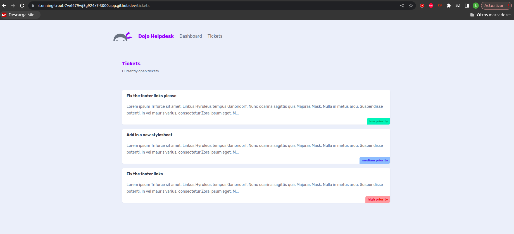

# Fetching Data

- Se incorporá en el directorio /tickets un nuevo componente que tomará datos desde un sitio web o dominio especifico.
- Veamos que contiene dicho fichero:

- Primero, hay una función llamada getTickets que se encarga de hacer una solicitud especial a una dirección en internet. Se espera que esta dirección contenga la información sobre los "tickets". Después de obtener la información, se organiza y se muestra en la página.

- Luego, está la función principal llamada TicketList. Esta función utiliza la función anterior para obtener la lista de "tickets". Luego, recorre cada uno de ellos y los presenta en la página web. Cada "ticket" se muestra en una especie de tarjeta virtual con su título, una parte de su descripción y un indicador de prioridad. Si no hay "tickets", se muestra un mensaje que dice que no hay problemas o tareas en este momento.

# Página Principal.

- Se hace un botón para con un enlace a la página tickets y desde ahí se hace la obtención de los datos y se muestran como tal.

